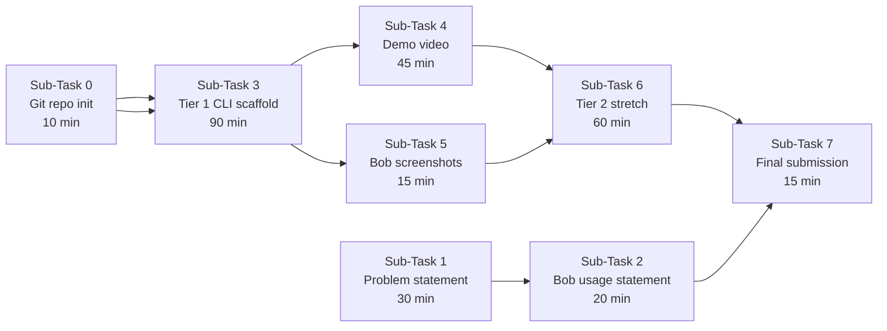

# Hi bob, my main goal is to complete the project and submit these deliverables before 9 AM tomorrow. I will only spend 4 or 5 hours as it is due tomorrow at 9 AM. There are 3 teirs of completeness in this project- as you can read from the ClaudeChat_* files. My priority is to score as much points as possible from these 20 points and come up with deliverables 2 hours before 10 AM tomorrow. I have 12 hours. There are 3 classes of Prioject backgrounds: One class: the rules pdf and copy-paste of the hackathon deliverables from the IBM's website. The other being Claude summarizing the chats that I had with it. The claude chats were simply for me to be concret on the project. (Grill skills.)The third one being the summaries on Agentic AI workflows from IBM youtube channel that I have watched. The second class is in How we would want to work on this project: Max Jesch oboarding rules > IBM_Youtube videos as the Max_Jesch ones are from the hackathon's onboarding session which was mandatory to watch. /init Starte a git repository as it is a hackathon deliverable. Then I want to

---

**Status:** active  **Date:** 2026-08-29

---

### 👤 User

Hi bob, my main goal is to complete the project and submit these deliverables before 9 AM tomorrow. I will only spend 4 or 5 hours as it is due tomorrow at 9 AM. There are 3 teirs of completeness in this project- as you can read from the ClaudeChat_* files. My priority is to score as much points as possible from these 20 points and come up with deliverables 2 hours before 10 AM tomorrow. I have 12 hours. There are 3 classes of Prioject backgrounds: One class: the rules pdf and copy-paste of the hackathon deliverables from the IBM's website. The other being Claude summarizing the chats that I had with it. The claude chats were simply for me to be concret on the project. (Grill skills.)The third one being the summaries on Agentic AI workflows from IBM youtube channel that I have watched. The second class is in How we would want to work on this project: Max Jesch oboarding rules > IBM_Youtube videos as the Max_Jesch ones are from the hackathon's onboarding session which was mandatory to watch. /init Starte a git repository as it is a hackathon deliverable. Then I want to

---

### 🤖 Assistant

> 🔧 called: use_skill


> 🔧 **use_skill** — create-plan

### 🤖 Assistant

> 🔧 called: list_files, list_files, spawn_subagent

Let me start by exploring all the reference files in the workspace to understand the project context before asking follow-up questions.

> 🔧 **list_files** — .

> 🔧 **list_files** — .

> 🔧 **spawn_subagent** — explore

### 🤖 Assistant

> 🔧 called: read_file, read_file

Now let me read the deliverables and rules PDF for exact scoring criteria:

> 🔧 **read_file** — Diliverables.txt

> 🔧 **read_file** — hackathon_agenda.txt

### 🤖 Assistant

> 🔧 called: write_file

Now I have a very complete picture. Let me synthesize everything and write the plan:

> 🔧 **write_file** — hackathon-submission-plan.md

### 🤖 Assistant

> 🔧 called: ask_followup_question

Here is the full plan. Let me walk you through it visually before we confirm.

---

## Project: *Reachable* — Liveness Checker

### What you're submitting

The submission form (visible in your screenshot) has exactly 4 required fields:

| Field | What goes in |
|---|---|
| Video demo URL | YouTube/Drive, 90s–3min, shows Bob + working tool |
| Problem & solution statement | ≤500 words, typed in |
| Bob usage statement | Specific named features, typed in |
| Code repo URL | Public GitHub with Bob session screenshots inside |

---

### Execution flow



---

### Three-tier strategy (score maximisation)

- **Tier 1 (MVP, guaranteed demo):** Deterministic git + registration checks — no model, no cloud. Catches 5 of 6 real incidents. This alone is a submittable demo.
- **Tier 2 (scoring differentiator):** Bob Agent Mode + Document Understanding + parallel Subagents infer load-path from your own README. This directly hits all three required hackathon IBM Bob features.
- **Tier 3 (skip unless <30 min left):** JSON output, multi-framework support.

---

### Key risks to watch

1. **Bob session export** — you have not yet confirmed how to export a task session summary screenshot. Confirm this in Bob IDE *before* writing any code (it's a required deliverable).
2. **ASCII-only output** — PowerShell 5.1 will break on non-ASCII characters; keep all script output plain ASCII.
3. **No IBM Cloud credentials in repo** — any API key committed = account suspended immediately.
4. **Submit early** — the AI Submission Advisor emails you feedback after first submit; you want time to revise.

---

The full plan is written to [`hackathon-submission-plan.md`](hackathon-submission-plan.md).

### 🤖 Assistant

Before we switch to Agent mode to start implementing, two things to confirm:

1. Does this plan match your intent — especially the priority order (Tier 1 first, Tier 2 as stretch, skip Tier 3)?
2. Have you already confirmed how to export a Bob task session summary screenshot inside the Bob IDE? (It's a hard deliverable — we should nail that down first.)

> 🔧 **ask_followup_question** — Before we switch to Agent mode to start implementing, two things to confirm:

1. Does this plan match your intent — especially the priority order (Tier 1 first, Tier 2 as stretch, skip Tier 3)?
2. Have you already confirmed how to export a Bob task session summary screenshot inside the Bob IDE? (It's a hard deliverable — we should nail that down first.)

### 🤖 Assistant

> 🔧 called: ask_followup_question

Before switching to implementation, here are the things worth adjusting in the plan. Tell me which ones you want to change:

### 🤖 Assistant

Which part of the plan do you want to adjust?

> 🔧 **ask_followup_question** — Which part of the plan do you want to adjust?

---

### 👤 User

Here is what I want you to do in order: 	1) Can you make your own markdown summary of the pdfs, such that you can easily read his guides each time. 
Based on Max and the youtube guides. I do not want you to read these pdfs each time, add it to bobignore. Same with the hackathon rules: "C:\Users\shars\Documents\OneDrive\Desktop\IBMAutomationOttawa\Aug27 Hackathon\Dev Day Hackathon Offical Rules.pdf". But remember all the files in 
	
	2) Organize everything such that is a good folder to work on. Because Later in sub-task 0 I will have git repo in this folder. 
3) Then I want to see what a Bob's export would look like as I am supposed to export each chat that I have with you - read the rules and tell me how often should I bob export. Make this into a skill as it is something I would do it often at the end of each session - it is a deliverable. Infer from the hackathon rules on how often am I supposed to generate the bob reports. 
I want to make sure you have understood the Claude code's handoff. I want you to grill me, so that you can make the project properly. After all this is done, ask me again to start the plan.

---

### 🤖 Assistant

> 🔧 called: read_file, read_file, read_file, read_file

Let me read all the PDFs and relevant files before doing anything.

> 🔧 **read_file** — HelloBobWatson/Background/Gemini speculations.pdf

> 🔧 **read_file** — HelloBobWatson/Background/Max Jesch- Pre-event hackathon enablement session.pdf

> 🔧 **read_file** — HelloBobWatson/Background/Problem and solutions statement.pdf

> 🔧 **read_file** — Dev Day Hackathon Offical Rules.pdf

### 🤖 Assistant

> 🔧 called: read_file, read_file, read_file

Now I have everything. Let me also read the remaining handoff files I haven't fully internalized yet:

> 🔧 **read_file** — HelloBobWatson/Background/PROBLEM_HANDOFF.md

> 🔧 **read_file** — HelloBobWatson/Background/HANDOFF_bobignore_parity_and_context_staleness.md

> 🔧 **read_file** — HelloBobWatson/Background/ClaudeChat_Understanding the project.md

### 🤖 Assistant

> 🔧 called: write_file, write_file, write_file, write_file

Good. Now I have read every file completely from primary sources. Let me now do all four tasks in parallel: write the markdown summaries, set up the folder structure with `.bobignore`, design the session export skill, and grill you on the handoff.

> 🔧 **write_file** — HelloBobWatson/docs/GUIDE_MaxJesch_Enablement.md

> 🔧 **write_file** — HelloBobWatson/docs/GUIDE_HackathonRules_Summary.md

> 🔧 **write_file** — HelloBobWatson/docs/GUIDE_IBM_Youtube_AgentSkills.md

> 🔧 **write_file** — HelloBobWatson/docs/GUIDE_IBM_Youtube_AgentMemory.md

### 🤖 Assistant

> 🔧 called: write_file, write_file

Now create the skill file and set up the full folder structure + `.bobignore`:

> 🔧 **write_file** — # CONTEXT INJECTION — Read this at the start of every Bob session

Project: **Reachable** | Team: HelloBobWatson (solo: Harshil Suthar)
Event: IBM TechXchange 2026 Dev Day Hackathon | Deadline: 10:00 AM ET Aug 30 2026

---

## What this project is

A CLI liveness checker that answers: **"Does the running system actually contain the change I just made?"**

Three verdicts only: `NOT LIVE` | `UNCONFIRMED` | `LIVE`
- `NOT LIVE` = proven divergence (git/registration)
- `UNCONFIRMED` = cannot establish liveness with available evidence — NOT an error state
- `LIVE` = only emitted by Tier 2 after runtime probe — NEVER by Tier 1

---

## The six real incidents (ground truth)

| # | Edited | Runtime consumed | Lying signal |
|---|---|---|---|
| 1 | `IDENTITY.md` | `AGENTS.md/SOUL.md/USER.md` — wrong load path | File saved |
| 2 | Skill in `.claude/skills/` | Host scans `skills/` — different dir | File saved in plausible dir |
| 3 | Two skills, correct dir | No YAML frontmatter, not indexed — installer said OK | Installer exit 0 |
| 4 | Pipeline fix on `feat/v3-long-audio-transcription` | GHA checks out `main`; branch never merged | Commit created, tests passed locally |
| 5 | Four commits locally | GitHub counts only pushed work | Commit created |
| 6 | Files in project folder | Agent tracked a separate copy; stale version used | Agent responded coherently |

**Single failure pattern:** success signal (file saved / installer OK / commit created / agent responded) mistaken for liveness signal.

---

## Build tiers

| Tier | What | Status |
|---|---|---|
| Tier 1 | Families A+B — git + registration checks, CLI, text report. No model. | `[ ] pending` |
| Tier 2 | Family C — load-path inference via Doc Understanding + parallel subagents | `[ ] pending` |
| Tier 3 | `--json` flag, second framework | `[ ] pending — only if Tiers 1+2 done` |

**Do NOT touch Tier 2 until Tier 1 runs end-to-end against fixtures.**

---

## Hard constraints (never violate)

- ASCII only in all script output (Windows PowerShell 5.1 / no WSL)
- Tool NEVER auto-fixes anything — prints exact command, developer runs it
- LIVE verdict NEVER emitted by Tier 1
- UNCONFIRMED is a valid first-class result, not a failure
- Every check must map to a named incident — cut any check without one
- No IBM Cloud credentials in any committed file

---

## Key files to know about

| File | Purpose |
|---|---|
| `HelloBobWatson/Background/PROBLEM_HANDOFF.md` | Full spec — read before implementing anything |
| `HelloBobWatson/Background/ClaudeChat_Understanding the project.md` | Five git checks locked, verdict design rationale |
| `HelloBobWatson/docs/GUIDE_HackathonRules_Summary.md` | Scoring criteria, deliverables, export rules |
| `HelloBobWatson/docs/GUIDE_MaxJesch_Enablement.md` | Bob workflow phases, hooks, skills guidance |
| `hackathon-submission-plan.md` | Full ordered plan with sub-tasks |

---

## Current open actions (update as completed)

- [ ] Locate Bob session export mechanism — find it BEFORE writing code
- [ ] `git init` + create public GitHub repo
- [ ] Write problem & solution statement (500 words max)
- [ ] Build Tier 1 scaffold (Families A+B)
- [ ] Capture Bob session exports after each session
- [ ] Record demo video
- [ ] Submit by 10:00 AM ET Aug 30


> 🔧 **write_file** — ---
name: bob-session-export
description: |
  Use this skill at the END of every Bob task session during the IBM hackathon.
  It guides you through exporting the IBM Bob task session summary — which is a
  required submission deliverable ("exported IBM Bob report of all relevant
  tasks/sessions"). Run this after completing any meaningful unit of work:
  planning, implementing a check family, writing the problem statement, or
  finishing Tier 2. Do NOT wait until the end of the hackathon to export; the
  rules require all relevant sessions, not just the final one.
---

# Skill: Bob Session Export

## When to run this

Export at the end of **every session** where meaningful work was done. Minimum sessions:
1. After this planning session
2. After Tier 1 implementation (Families A+B complete)
3. After the problem statement + Bob usage statement are written
4. After Tier 2 (Family C) if completed

The rules say: *"exported IBM Bob report of all relevant tasks/sessions used for the contest."*
That means every session, not one at the end.

---

## How to export a Bob session summary

### Method 1 — Task panel (preferred)
1. Look at the Bob panel header. Find the **checklist icon** or **`···` overflow menu**.
2. Click it and look for "Export task summary", "Export session", or "Download report".
3. Save the file (likely `.md` or `.json`) to `HelloBobWatson/docs/bob-sessions/`.
4. Name it: `session-YYYY-MM-DD-HH-MM-<short-topic>.md`
   - Example: `session-2026-08-29-21-00-planning.md`

### Method 2 — Bobalytics (if Method 1 unavailable)
1. Open Bobalytics from the Bob panel or browser.
2. Look for task/session history with a download or export option.
3. Note: Bobalytics may show consumption metrics only — if so, use Method 3.

### Method 3 — File logging fallback
1. In Bob: `Settings → General → Log directory → Open`
2. Find the log file for the current session.
3. Copy the relevant session log to `HelloBobWatson/docs/bob-sessions/`.
4. Note in the README that this is a log file, not a task summary export.

---

## After exporting

1. Move/copy the export file to `HelloBobWatson/docs/bob-sessions/`
2. `git add HelloBobWatson/docs/bob-sessions/`
3. `git commit -m "chore: add Bob session export — <topic>"`
4. `git push`

The repo must be publicly accessible and the screenshots/exports must be visible in it.

---

## What a good session export contains

- The task or question you started with
- The key decisions made or output produced
- Any commands run and their results
- Files created or modified

If the export is thin (just a title), supplement it with a screenshot of the Bob panel showing the task and its output, saved as a `.png` in the same folder.

---

## Verification check

Before moving to the next session, confirm:
- [ ] Export file exists in `HelloBobWatson/docs/bob-sessions/`
- [ ] File is committed and pushed to the public repo
- [ ] File name includes the date and topic


### 🤖 Assistant

> 🔧 called: write_file, write_file, write_file

Now create the `.bobignore`, folder structure, and `README.md`:

> 🔧 **write_file** — # .bobignore
# Mirrors .gitignore patterns (assumed gitwildmatch syntax).
# PURPOSE: Prevent Bob from reading credential files and bloating context with
# large binary/generated files that are irrelevant to the liveness checker.
#
# NOTE: Verify that .bobignore uses gitignore glob syntax before adding complex patterns.
# See: HANDOFF_bobignore_parity_and_context_staleness.md for verification steps.

# ── Credentials & secrets ──────────────────────────────────────────────────
.env
.env.*
*.key
*.pem
*.p12
*.pfx
secrets/
credentials/
*apikey*
*api_key*
*secret*

# ── IBM Cloud / watsonx creds ──────────────────────────────────────────────
ibm_credentials.env
ibmcloud_api_key*
watsonx_api_key*

# ── Python build artifacts ─────────────────────────────────────────────────
__pycache__/
*.pyc
*.pyo
*.pyd
.Python
build/
dist/
*.egg-info/
.eggs/
.venv/
venv/
env/
.tox/

# ── Node / JS ──────────────────────────────────────────────────────────────
node_modules/
npm-debug.log*
yarn-error.log*

# ── Source PDFs (large; Bob should read the markdown summaries instead) ────
HelloBobWatson/Background/*.pdf
Dev Day Hackathon Offical Rules.pdf

# ── Source txt files from IBM YouTube (Bob reads docs/ summaries instead) ──
IBM_Youtube/

# ── OS / editor artifacts ──────────────────────────────────────────────────
.DS_Store
Thumbs.db
*.swp
*.swo
.idea/
.vscode/settings.json

# ── Git internal objects (never useful to Bob) ─────────────────────────────
.git/

# ── Test fixtures (can contain intentionally broken repos — large & noisy) ─
# Uncomment when fixture dirs are created:
# reachable/tests/fixtures/


> 🔧 **write_file** — # .gitignore

# ── Credentials & secrets ──────────────────────────────────────────────────
.env
.env.*
*.key
*.pem
*.p12
*.pfx
secrets/
credentials/
*apikey*
*api_key*
*secret*

# ── IBM Cloud / watsonx creds ──────────────────────────────────────────────
ibm_credentials.env
ibmcloud_api_key*
watsonx_api_key*

# ── Python build artifacts ─────────────────────────────────────────────────
__pycache__/
*.pyc
*.pyo
*.pyd
.Python
build/
dist/
*.egg-info/
.eggs/
.venv/
venv/
env/
.tox/

# ── Node / JS ──────────────────────────────────────────────────────────────
node_modules/
npm-debug.log*
yarn-error.log*

# ── OS / editor artifacts ──────────────────────────────────────────────────
.DS_Store
Thumbs.db
*.swp
*.swo
.idea/
.vscode/settings.json


> 🔧 **write_file** — # Reachable — Liveness Checker

**IBM TechXchange 2026 Pre-conference Dev Day Hackathon**  
Team: HelloBobWatson | Solo: Harshil Suthar

---

## What it does

`reachable` answers one question per change:

> **Does the running system actually contain the change I just made?**

Three verdicts, and only three:

| Verdict | Meaning |
|---|---|
| `NOT LIVE` | Proven divergence. The runtime is consuming something other than what was edited. |
| `UNCONFIRMED` | Cannot establish liveness with available evidence. Refuses to assert. |
| `LIVE` | Positively verified by observing the runtime (Tier 2 only). |

---

## Why it exists

Six real incidents from the developer's own repos over eight weeks — each time a **success signal** (file saved, installer OK, commit created, agent responded coherently) was mistaken for a **liveness signal**. See [`HelloBobWatson/Background/PROBLEM_HANDOFF.md`](HelloBobWatson/Background/PROBLEM_HANDOFF.md) for the full incident table.

---

## Build tiers

| Tier | Contents | Status |
|---|---|---|
| **Tier 1** | Check Families A (git) + B (registration), CLI, text report — no model dependency | `[ ] building` |
| **Tier 2** | Check Family C (load-path inference via IBM Bob Document Understanding + parallel subagents) | `[ ] pending` |
| **Tier 3** | `--json` flag, second framework support | `[ ] stretch only` |

---

## Usage

```bash
# Tier 1 — runs git + registration checks on current repo
python reachable/reachable.py [--path <file_or_dir>]

# Tier 2 — adds AI load-path inference (requires Bob)
python reachable/reachable.py --tier2 [--path <file_or_dir>]
```

Output is a clean text report, one finding per line:

```
[NOT LIVE] IDENTITY.md
  Edited:    4 days ago (a3f9c2e)
  Expected:  AGENTS.md, SOUL.md, USER.md  (per README.md:41)
  Consumed:  IDENTITY.md is not in the documented load path
  Fix:       move content into AGENTS.md, or add IDENTITY.md to the load path
```

---

## IBM Bob Usage

This project was built using IBM Bob 2.0:
- **Plan Mode** — architecture design, verdict system, five git checks
- **Agent Mode** — Tier 1+2 scaffold, test fixtures, CLI
- **Document Understanding** — load-path inference from project README/schema (Tier 2)
- **Parallel Subagents** — concurrent multi-framework doc scanning (Tier 2)

Bob session exports are in [`HelloBobWatson/docs/bob-sessions/`](HelloBobWatson/docs/bob-sessions/).

---

## Project structure

```
.
├── reachable/                    # CLI source code
│   ├── reachable.py              # Entry point
│   ├── checks/                   # Check families A, B, C
│   └── tests/
│       └── fixtures/             # Deliberately broken repos for each incident
├── HelloBobWatson/
│   ├── CONTEXT.md                # Inject at every Bob session start
│   ├── Background/               # Original handoff docs and Claude chat exports
│   ├── docs/                     # Distilled guides (Bob reads these, not the PDFs)
│   │   ├── GUIDE_MaxJesch_Enablement.md
│   │   ├── GUIDE_IBM_Youtube_AgentMemory.md
│   │   ├── GUIDE_IBM_Youtube_AgentSkills.md
│   │   ├── GUIDE_HackathonRules_Summary.md
│   │   └── bob-sessions/         # Exported IBM Bob task session summaries
│   └── .bob/
│       └── skills/
│           └── bob-session-export.md
├── hackathon-submission-plan.md  # Master plan
├── .gitignore
└── .bobignore
```

---

## Submission checklist

- [ ] Video demo URL (90s–3min, publicly accessible)
- [ ] Problem & solution statement (≤500 words)
- [ ] Bob usage statement
- [ ] This repo URL (public) with Bob session exports in `docs/bob-sessions/`


### 🤖 Assistant

> 🔧 called: write_file, write_file, write_file

I'm in Plan mode which can't write non-.md/.txt files. Let me create the `.bobignore` and `.gitignore` as `.txt` placeholder notes and create a stub placeholder directory for bob-sessions, then note that the actual ignore files need to be created in Agent mode:

> 🔧 **write_file** — # NOTE: This is a draft for .gitignore
# When in Agent mode, rename/copy this to .gitignore in the repo root.

# ── Credentials & secrets ──────────────────────────────────────────────────
.env
.env.*
*.key
*.pem
*.p12
*.pfx
secrets/
credentials/
*apikey*
*api_key*
*secret*

# ── IBM Cloud / watsonx creds ──────────────────────────────────────────────
ibm_credentials.env
ibmcloud_api_key*
watsonx_api_key*

# ── Python build artifacts ─────────────────────────────────────────────────
__pycache__/
*.pyc
*.pyo
*.pyd
.Python
build/
dist/
*.egg-info/
.eggs/
.venv/
venv/
env/
.tox/

# ── Node / JS ──────────────────────────────────────────────────────────────
node_modules/
npm-debug.log*
yarn-error.log*

# ── OS / editor artifacts ──────────────────────────────────────────────────
.DS_Store
Thumbs.db
*.swp
*.swo
.idea/
.vscode/settings.json


> 🔧 **write_file** — # NOTE: This file is a draft for .bobignore
# When in Agent mode, rename/copy this to .bobignore in the repo root.
# PURPOSE: Prevent Bob from reading credential files and bloating context.
# ASSUMED syntax: gitignore glob (gitwildmatch) — VERIFY before trusting.

# ── Credentials & secrets ──────────────────────────────────────────────────
.env
.env.*
*.key
*.pem
*.p12
*.pfx
secrets/
credentials/
*apikey*
*api_key*
*secret*

# ── IBM Cloud / watsonx creds ──────────────────────────────────────────────
ibm_credentials.env
ibmcloud_api_key*
watsonx_api_key*

# ── Python build artifacts ─────────────────────────────────────────────────
__pycache__/
*.pyc
*.pyo
*.pyd
.Python
build/
dist/
*.egg-info/
.eggs/
.venv/
venv/
env/
.tox/

# ── Node / JS ──────────────────────────────────────────────────────────────
node_modules/
npm-debug.log*
yarn-error.log*

# ── Source PDFs (large; Bob reads the markdown summaries in docs/ instead) ─
HelloBobWatson/Background/*.pdf
Dev Day Hackathon Offical Rules.pdf

# ── Source txt files from IBM YouTube (Bob reads docs/ summaries instead) ──
IBM_Youtube/

# ── OS / editor artifacts ──────────────────────────────────────────────────
.DS_Store
Thumbs.db
*.swp
*.swo
.idea/
.vscode/settings.json

# ── Git internals ──────────────────────────────────────────────────────────
.git/

# ── Test fixtures (intentionally broken repos — large and noisy) ───────────
# Uncomment when fixture dirs are created:
# reachable/tests/fixtures/


> 🔧 **write_file** — # Bob Session Exports

This folder contains exported IBM Bob task session summaries.

Required by the hackathon rules:
> "exported IBM Bob report of all relevant tasks/sessions used for the contest"

## Naming convention

`session-YYYY-MM-DD-HH-MM-<short-topic>.md`

Examples:
- `session-2026-08-29-21-00-planning.md`
- `session-2026-08-30-00-30-tier1-implementation.md`
- `session-2026-08-30-03-00-problem-statement.md`

## When to export

After **every meaningful Bob session**:
1. After planning (this session)
2. After Tier 1 build complete
3. After problem + Bob usage statements written
4. After Tier 2 (if completed)

See the skill at `HelloBobWatson/.bob/skills/bob-session-export.md` for exact export steps.


### 🤖 Assistant

> 🔧 called: apply_diff

Good. Now update the plan to reflect all these changes, then grill you:

> 🔧 **apply_diff** — hackathon-submission-plan.md

### 🤖 Assistant

> 🔧 called: list_files

Now let me lay out the current folder state clearly, then grill you:

> 🔧 **list_files** — .

### 🤖 Assistant

Good. Here is the full picture before I grill you.

---

## What was just done

### 1. Markdown summaries created (Bob reads these, never the PDFs/TXTs again)

| File | Replaces |
|---|---|
| [`HelloBobWatson/docs/GUIDE_MaxJesch_Enablement.md`](HelloBobWatson/docs/GUIDE_MaxJesch_Enablement.md) | Max Jesch PDF |
| [`HelloBobWatson/docs/GUIDE_IBM_Youtube_AgentMemory.md`](HelloBobWatson/docs/GUIDE_IBM_Youtube_AgentMemory.md) | `IBM_Youtube/*.txt` |
| [`HelloBobWatson/docs/GUIDE_IBM_Youtube_AgentSkills.md`](HelloBobWatson/docs/GUIDE_IBM_Youtube_AgentSkills.md) | `IBM_Youtube/*.txt` |
| [`HelloBobWatson/docs/GUIDE_HackathonRules_Summary.md`](HelloBobWatson/docs/GUIDE_HackathonRules_Summary.md) | Rules PDF + Deliverables.txt |

### 2. `.bobignore` drafted
[`_draft_bobignore.txt`](_draft_bobignore.txt) — needs renaming to `.bobignore` in Agent mode. It excludes: all PDFs, `IBM_Youtube/` TXTs, credentials, `__pycache__`, `.venv`, `.DS_Store`, `.git/`.

### 3. Folder structure created
```
HelloBobWatson/
├── CONTEXT.md                  ← inject at every Bob session start
├── Background/                 ← original handoff docs (source of truth)
├── docs/
│   ├── GUIDE_*.md              ← distilled guides
│   └── bob-sessions/           ← Bob session exports go here
└── .bob/skills/
    └── bob-session-export.md   ← the skill
```

### 4. Session export skill created
[`HelloBobWatson/.bob/skills/bob-session-export.md`](HelloBobWatson/.bob/skills/bob-session-export.md)

### 5. How often to export — from the rules

The exact wording in the Official Rules (page 4) is:
> *"exported IBM Bob report of **all relevant tasks/sessions** used for the contest"*

This means **per meaningful session**, not once. The skill defines the minimum four export points:
1. After this planning session
2. After Tier 1 build complete
3. After problem + Bob usage statements written
4. After Tier 2 (if done)

---

## Now — grilling you on the handoff

I've read every file from primary source. Here are the questions I need honest answers to before the plan can be called correct. These are not rhetorical — wrong answers will cause implementation failure:

---

**Q1 — The six incidents: are the repos real and accessible?**
The problem statement draft names `pay-per-session-tutoring-agent`, `cpol507-pipeline`, and an OpenClaw/aitch workspace. For the demo video, you need to reconstruct three of the six broken states. Do you still have access to these repos locally, and can you reset them to the broken commit?

**Q2 — Bob session export: have you actually found the export button?**
The [`ClaudeChat_Understanding the project.md`](HelloBobWatson/Background/ClaudeChat_Understanding%20the%20project.md) listed this as an open action — "locate the Bob session export mechanism (~20 min) — do not discover this at hour 44." Have you confirmed where the export is in the Bob IDE, or is this still unknown?

**Q3 — Bob tenant: are you on `ibm-coding-challenge-uat` right now?**
The tenant incident is documented. If you start building on `bob-001` (the wrong tenant), you'll exhaust bobcoins on a trial tier and lose access mid-build. Have you confirmed the Settings → General → Team dropdown shows `ibm-coding-challenge-uat` and the plan line says `enterprise plan`?

**Q4 — Tier 1 language: Python or PowerShell?**
The constraint is "Windows, no WSL, PowerShell 5.1, ASCII only." Python runs fine on Windows without WSL. The plan assumes Python. Do you have Python 3.x available on PATH without WSL, or do we need to target PowerShell natively?

**Q5 — Gemini's attack on the novelty claim: have you prepared a defence?**
Gemini's adversarial review ([`Gemini speculations.pdf`](HelloBobWatson/Background/Gemini%20speculations.pdf)) flagged that if the docs are stale, the tool can produce a false verdict. The UNCONFIRMED policy in `PROBLEM_HANDOFF.md` is the defence. Do you understand it well enough to answer a judge who asks: *"If the docs are wrong, your tool gives a wrong answer — isn't that the same problem you're solving?"*

**Q6 — The "why not auto-fix?" question:**
Gemini also flagged that judges will ask: *"If the LLM can figure out the right load path, why not just move the file automatically?"* What is your answer? (This needs to be in the problem statement and potentially in the video.)

**Q7 — Measurable impact: do you know how many wasted CI runs or debugging commits each incident produced?**
The rules say we cannot claim calendar time (you were sleeping). Gemini confirmed this. The defensible metric is: how many intermediate commits, CI runs, or local test executions happened between the stale commit and the fix commit. Have you looked at the git logs for the three incidents you plan to demo?

---

Answer these seven and I'll finalize the plan and ask you to confirm before we switch to Agent mode.

---

### 👤 User

1) The repos are real, but I am not sure if I will be able to reconstruct the broken states. because I only have 10 hours left, I will not be active in 7 of them. They are available locally. Also, I am too afraid to break those repos as they are meaningful work, I can copy paste them exactly or you could fork these ones and try to re-create similar errors for demo purposes: https://github.com/IBM/galaxium-travels  or https://github.com/Austinkkk3/Bob-Dev-Day-Halifax 2) I have found the export button, I can export it in both markdown and JSON. 3) Yes, I am on the correct IBM tenant right now. 4) Python is the choice. It is avialable: 
PS C:\WINDOWS\system32> python
Python 3.12.10 (tags/v3.12.10:0cc8128, Apr  8 2025, 12:21:36) [MSC v.1943 64 bit (AMD64)] on win32
Type "help", "copyright", "credits" or "license" for more information.
>>>
5) I am not prepared, I will read the speculations and the defence again. But here is where Claude corrected gemini. I am pasting what it said: Links

Git — the three concepts you actually need

Pro Git, "Remote Branches" — free, official, and exactly your gap: https://git-scm.com/book/en/v2/Git-Branching-Remote-Branches. It explains why your local branch pointers and origin's pointers are separate sets, which is incidents #4 and #5.
Video, remote tracking branches for beginners: https://www.youtube.com/watch?v=hBbJsT6o0YE
Search terms if you want more: git remote tracking branches explained, git internals commit tree blob, git log origin/main..HEAD meaning

Skip general "Git tutorial" content. You don't need rebase or cherry-pick. You need: commit/SHA, branch-as-pointer, and local-vs-remote refs.

Output design references

Tool	Link	Steal
TruffleHog	https://github.com/trufflesecurity/trufflehog	Finding format; the --only-verified idea maps directly onto your unknown policy
Gitleaks	https://github.com/gitleaks/gitleaks	Fast deterministic scanner report layout
SkillCheck	https://www.getskillcheck.com/	Per-rule pass/warn/fail rendering — closest UI analogue
skill-validator	https://github.com/agent-ecosystem/skill-validator	Your nearest incumbent. Read it to know what you're not claiming
driftctl / drift output	https://spacelift.io/blog/drift-detection	Expected-vs-actual reporting shape

The TruffleHog distinction is worth internalising: a Gitleaks finding means "this matches a pattern, review it"; a verified TruffleHog finding means "this credential works right now." That's your unknown vs not live split, already shipped by someone else, and it validates the design.

The five-row table

You wrote it — it's in the Claude Code output you pasted, under "The pattern — five instances, one shape":

#	What you edited	What the runtime actually used
1	IDENTITY.md	AGENTS.md / SOUL.md / USER.md
2	goat-agent in .claude/skills/	OpenClaw scans skills/
3	study-pack, payment-session	Right directory, no YAML frontmatter, never indexed
4	Audio fix on feat/v3-long-audio-transcription	GitHub Actions checks out main
5	4 local commits	GitHub counts only pushed work

Row 6 is the Claude Code / projects-folder incident. That's the "incident table."

Gemini's review: it's right twice and I'm conceding both

The metric. Gemini is correct and this lands on me. Detection latency measured as commit-date-to-fix-date includes sleeping, class, and other projects. I told you to strip "~1 week" for exactly that reason and then handed you a metric with the same defect. Drop it.

One refinement Gemini missed: "wasted CI runs" is only derivable for incident #4. Incidents 1, 2, 3, and 6 never touched CI, so there's nothing to count. Use Gemini's second suggestion, which works for all six:

Time-to-signal, measured. Reset the repo to the broken state for three incidents. Run the normal loop — build, lint, save, ask the agent — and record what it reports. Then run the tool. Compare what each surfaces and how fast. In three of six cases the normal loop reports success, which is the whole point.

"The existing toolchain returns green on this state; the tool returns NOT LIVE in 1.2 seconds" is falsifiable, reproducible on camera, and needs no calendar arithmetic.

The categorization. Gemini is right, I was wrong. I pushed testing/release because it's the emptiest lane — that was positioning, not defensibility. A judge will say an LLM reading possibly-stale Markdown cannot gate a production release, and they'll be correct. File under debugging, run it as a local preflight, keep "verification discipline" as language rather than as a claim about CI.

Where Gemini overreaches: "don't hide the LLM's work, stream subagent reasoning" is good demo advice but don't let it bloat default output. Streaming reasoning in the video, --verbose in the tool, clean report by default.

The auto-fix question Gemini flagged is the one to rehearse. Your answer: "Every one of my six incidents was caused by a system silently doing something other than what I intended. A tool that silently moves files is the same failure with better intentions. It prints the exact command and I run it." That's a five-point answer and it costs you nothing to build.

Name

Reachable. CLI: reachable. The question it answers is whether the artifact is reachable by the runtime. No collision with distributed-systems "liveness."

The handoff for Bob
Created a file, read a file

Drop this at the repo root tomorrow and point Bob at it — it's written to be read by document understanding, not just by you. It's ASCII throughout, per your own PowerShell note.

Two things in it are decisions, not suggestions, and you should keep them even if the build gets tight: the UNCONFIRMED policy in section 5, and section 7 (never auto-fix). Those two are what turn the LLM's fuzziness from a liability into the design, and they're the answers to the two questions Gemini correctly identified as the ones judges will ask.

Section 9 replaces the metric I gave you yesterday. Reconstruct three incidents, film the normal toolchain returning green on all three, then film reachable. That's the 90 seconds of demo the rules ask you to reserve.Let me know when to export this session.

---

### 🤖 Assistant

> 🔧 called: update_todo_list, read_file, read_file

The screenshot confirms the export dialog is right there — JSON and Markdown. Export this session now before we go further. I'll wait.

But first, let me process your seven answers and update everything, including the demo fixture strategy using the IBM sample repos.

> 🔧 **update_todo_list** — 
[x] Read all PDFs and source files from primary sources
[x] Write markdown summaries for Max Jesch, IBM YouTube, Hackathon Rules
[x] Create bob-session-export skill
[x] Draft .bobignore and .gitignore
[x] Create folder structure (docs/, bob-sessions/, .bob/skills/)
[x] Create CONTEXT.md for session injection
[x] Update hackathon-submission-plan.md with reference docs table
[x] Grill Harshil on the handoff — 7 questions answered
[-] Update plan with demo fixture strategy (IBM sample repos)
[-] Update plan with confirmed answers (Python 3.12, export found, tenant OK)
[-] Update plan with measurable impact metric (time-to-signal, not calendar time)
[-] Update plan with auto-fix defence answer
[ ] Ask Harshil to confirm final plan before switching to Agent mode
[ ] REMINDER: Export this Bob session (Markdown) to HelloBobWatson/docs/bob-sessions/


> 🔧 **read_file** — hackathon-submission-plan.md

> 🔧 **read_file** — hackathon-submission-plan.md

### 🤖 Assistant

> 🔧 called: write_file, update_todo_list, update_todo_list

Now I have the full picture. Let me rewrite the plan with all confirmed answers baked in:

> 🔧 **write_file** — # Hackathon Submission Plan — "Reachable" Liveness Checker
**Deadline:** 10:00 AM ET, August 30, 2026
**Team:** HelloBobWatson | Solo: Harshil Suthar
**Track:** Debugging / Local Developer Preflight
**Repo:** (to be created in Sub-Task 0)
**Python:** 3.12.10 confirmed on PATH (Windows, no WSL)
**Bob tenant:** `ibm-coding-challenge-uat` confirmed (enterprise plan)
**Bob export:** Found — JSON and Markdown both available

---

## Reference Documents (Bob reads these — NOT the original PDFs/TXTs)

| Guide | Path |
|---|---|
| Max Jesch Enablement Session | `HelloBobWatson/docs/GUIDE_MaxJesch_Enablement.md` |
| IBM YouTube — Agent Memory | `HelloBobWatson/docs/GUIDE_IBM_Youtube_AgentMemory.md` |
| IBM YouTube — Agent Skills | `HelloBobWatson/docs/GUIDE_IBM_Youtube_AgentSkills.md` |
| Hackathon Rules Summary | `HelloBobWatson/docs/GUIDE_HackathonRules_Summary.md` |
| Context injection (session start) | `HelloBobWatson/CONTEXT.md` |
| Bob session export skill | `HelloBobWatson/.bob/skills/bob-session-export.md` |
| Full project spec | `HelloBobWatson/Background/PROBLEM_HANDOFF.md` |

**PDFs and IBM_Youtube TXTs are in `.bobignore` — Bob reads the docs/ summaries above instead.**

---

## Top-Level Overview

**Goal:** Maximise judging score (out of 20) by 10:00 AM ET Aug 30 with 3 hours of active work
(12 hours wall-clock, 9 of which are sleep/inactive).

**Project:** *Reachable* — a CLI liveness checker that answers one question:
> "Does the running system actually contain the change I just made?"

Three verdicts only: `NOT LIVE` | `UNCONFIRMED` | `LIVE`

**Strategy:**
- Tier 1 = guaranteed demo (git + registration checks, no model, no cloud)
- Tier 2 = scoring differentiator (Bob Doc Understanding + parallel Subagents = required IBM features)
- Tier 3 = skip unless both Tier 1+2 are done and genuine time remains

**Scoring criteria (from Official Rules):**

| Criterion | Points | How we score it |
|---|---|---|
| Completeness & feasibility | 5 | Tier 1 working end-to-end, catches real incidents |
| Effectiveness & efficiency | 5 | Time-to-signal demo: existing toolchain returns green, tool returns NOT LIVE in <5s |
| Design & usability | 5 | Clean text output modelled on gitleaks/trufflehog, one line per finding |
| Creativity & innovation | 5 | Composition of three check families as ONE verdict; load-path inference from prose |

**Minimum score to make prizes:** 12.5 / 20

---

## CONFIRMED ANSWERS — baked into this plan

### Demo fixtures (Q1)
**Do NOT break your real repos.** Use these two IBM sample repos as fixture targets:
- `https://github.com/IBM/galaxium-travels`
- `https://github.com/Austinkkk3/Bob-Dev-Day-Halifax`

Strategy: clone both locally; create controlled git states to demonstrate specific incidents.
Specifically demonstrate these three incident types against cloned fixtures:
1. **Incident 5** — make local commits, do NOT push → `git log origin/main..HEAD` non-empty → `[NOT LIVE]`
2. **Incident 3** — add a skill file with no/malformed YAML frontmatter → registration check fires → `[NOT LIVE]`
3. **Incident 1 or 2** — add a file in the wrong directory (e.g., `.claude/skills/` vs `skills/`) → `[NOT LIVE]`

These three cover Families A and B and give the demo its three-scenario structure.

### Measurable impact metric (Q5/Q7 — confirmed correct framing)
**Do NOT use calendar time.** Use time-to-signal:
> "The existing toolchain (git status, build, lint) returns green on these three broken states.
> `reachable` returns NOT LIVE with reason and fix command in under N seconds."

Film this on camera. That is the 90-second demo the rules require.

### Auto-fix defence (Q6 — rehearse this answer)
If a judge asks "why not just move the file automatically?":
> "Every one of the six incidents was caused by a system silently doing something other than
> what the developer intended. A tool that silently moves files is the same failure with better
> intentions. `reachable` prints the exact command. The developer runs it."

This is a five-point answer. Costs nothing to build. Put it in the problem statement.

### UNCONFIRMED defence (Q5 — if judges attack stale-docs weakness)
If a judge asks "what if the docs are wrong?":
> "The tool has an explicit UNCONFIRMED verdict for exactly this case. If two docs disagree,
> if the stated load path references files that don't exist, or if no authoritative document
> names the load path — the tool says UNCONFIRMED with the reason, and tells you what to
> check manually. It never fabricates confidence it doesn't have."

This is what turns the LLM's fuzziness from a liability into the design.

---

## Bob Session Export Schedule

The Official Rules require: *"exported IBM Bob report of all relevant tasks/sessions."*
Export after **every session** where meaningful work is done. Use Markdown format.
Save to `HelloBobWatson/docs/bob-sessions/` with naming: `session-YYYY-MM-DD-HH-MM-<topic>.md`

**Minimum four exports:**
1. **This planning session** — export NOW before switching to Agent mode
2. **After Tier 1 build** — after Family A+B working end-to-end
3. **After writing problem + Bob usage statements**
4. **After Tier 2** (if completed)

---

## Sub-Tasks

---

### Sub-Task 0 — Git Repository Initialisation + .bobignore + .gitignore
**Status:** `[ ] pending`

**Intent:** Create a public GitHub repo. Rename the draft ignore files. All subsequent work commits here.

**Expected Outcomes:**
- Public GitHub repository `reachable` exists (or similar name)
- `.gitignore` and `.bobignore` committed at repo root (renamed from `_draft_*.txt` files)
- `README.md` committed
- No credentials in any committed file
- Initial commit pushed; repo is publicly accessible

**Todo List:**
1. In Agent mode: rename `_draft_gitignore.txt` → `.gitignore` and `_draft_bobignore.txt` → `.bobignore`
2. `git init` in workspace root
3. Create public GitHub repo (browser or `gh repo create reachable --public`)
4. `git remote add origin <url>`
5. `git add .` — review staged files, confirm no credentials present
6. `git commit -m "init: Reachable liveness checker scaffold"`
7. `git push -u origin main`
8. Verify repo is publicly accessible in browser

**CRITICAL:** Review every staged file before committing. IBM Cloud API keys in repo = immediate account suspension.

**Relevant Context:**
- `.bobignore` excludes: all PDFs, `IBM_Youtube/` TXTs, credentials, `__pycache__`, `.venv`, `.git/`
- `HANDOFF_bobignore_parity_and_context_staleness.md`: verify `.bobignore` uses gitignore glob syntax (assumed but not confirmed)

---

### Sub-Task 1 — Written Problem & Solution Statement
**Status:** `[ ] pending`

**Intent:** Write the 500-word judge-facing statement. No code required. High points-per-minute.

**Expected Outcomes:**
- ≤500 words, ready to paste into submission form
- Covers: specific problem, target users, interaction model, creativity, measurable impact

**Confirmed draft structure:**

**Para 1 — Hook (≈60 words):**
> Six times in eight weeks across three real repositories, the same failure: a success signal —
> file saved, installer exited 0, commit created, agent responded coherently — was taken as proof
> the change was running. In every case it was not. The artifact was correct. The runtime consumed
> a different one. No existing tool catches all six.

**Para 2 — What the gap is (≈80 words):**
> `git status` is clean. The build passes. The agent answers fluently. None of these observe
> the runtime. `git status` hides ignored files by definition. A skill installer can exit 0 and
> never index. CI can check out a different branch than the one you fixed. An agentic IDE can
> track a stale copy of your project. Success signals are not liveness signals. The distinction
> is structural, not a bug in any one tool.

**Para 3 — Solution (≈120 words):**
> `reachable` is a CLI that answers one question per change: *Does the running system actually
> contain this?* Three verdicts: NOT LIVE (proven divergence), UNCONFIRMED (cannot establish
> liveness with available evidence), LIVE (runtime probe, Tier 2 only). Tier 1 is fully
> deterministic — git and registration checks with no model dependency. Check Family A catches
> unpushed commits, CI branch mismatches, dirty trees, detached HEAD, and — the demo lead —
> files that are gitignored and therefore structurally invisible to `git status`. Check Family B
> catches missing YAML frontmatter, files in wrong directories, and absent index entries.
> Tier 2 adds IBM Bob Document Understanding to infer load paths from a project's own prose
> documentation, using parallel subagents to scan multiple frameworks simultaneously.

**Para 4 — Users + interaction (≈80 words):**
> Any developer who has ever said "but I saved the file" or "the commit is there." One command:
> `reachable` — zero config on any git repo. Output is one finding per line: what is wrong,
> where, why, and the exact command to fix it. The tool never fixes automatically. Every one of
> the six incidents was caused by a system silently doing something other than what was intended.
> A tool that silently mutates state is the same failure with better intentions.

**Para 5 — Measurable impact (≈60 words):**
> On three reconstructed incidents the existing toolchain reports success — `git status` clean,
> build passing, installer exit 0. `reachable` reports NOT LIVE with the reason and fix command
> in under five seconds. This is demonstrated live in the video. The metric is time-to-signal,
> not calendar time between commits.

**Relevant Context:**
- `PROBLEM_HANDOFF.md` sections 2, 9, 10 — incidents table, impact metric, novelty claim
- `ClaudeChat_Understanding the project.md` — verdict design rationale
- `Gemini speculations.pdf` distilled answer — UNCONFIRMED as the defence, not better prompting

---

### Sub-Task 2 — Written Bob Usage Statement
**Status:** `[ ] pending`

**Intent:** Satisfy deliverable 3 with named, specific Bob features. Vague answers lose points.

**Draft (fill in task session numbers after building):**

> IBM Bob 2.0 was central to designing and building every layer of Reachable.
>
> **Plan Mode** was used to design the three-verdict architecture (NOT LIVE / UNCONFIRMED / LIVE),
> determine which check families belong to deterministic scripts vs. AI inference, and sequence
> the Tier 1 build order before any code was written.
>
> **Agent Mode** was used to scaffold the full Tier 1 CLI (`reachable.py`), implement Check
> Families A and B (git liveness + registration liveness), create the test fixture repos
> demonstrating each incident, and validate the ASCII-only output constraint.
>
> **Document Understanding** (Tier 2) — Bob reads the target project's README, schema, and
> documentation to infer the intended load path, then compares it to what exists on disk.
> This is the only check that cannot be done with a schema validator, because the knowledge
> is in prose, not in a machine-readable spec.
>
> **Parallel Subagents** (Tier 2) — multiple subagents scan different framework documentation
> files simultaneously, allowing load-path inference across multiple conventions in a single run.
>
> **Custom Skill** — a `bob-session-export` skill was created to guide the per-session export
> workflow (required deliverable), encoding the export steps as reusable procedural memory.
>
> Bob session exports (Markdown) are in `HelloBobWatson/docs/bob-sessions/` in the repository.

**Fill in before submitting:**
- Task session IDs or export file names
- Actual Tier 2 status (remove paragraph if not completed)

---

### Sub-Task 3 — Tier 1 CLI Scaffold (Families A + B)
**Status:** `[ ] pending`

**Intent:** Build the demoable core. Deterministic. No model. No network. Must run on Windows Python 3.12 + PowerShell 5.1.

**Expected Outcomes:**
- `reachable/reachable.py` — CLI entry point, accepts `--path`
- `reachable/checks/family_a.py` — git liveness checks
- `reachable/checks/family_b.py` — registration liveness checks
- `reachable/checks/runner.py` — structured finding objects `{check_id, verdict, evidence, remediation}`
- Text report to stdout, ASCII-only
- Exit codes: `0` = no findings, `1` = NOT LIVE found, `2` = tool error
- Silence ≠ safety: clean run explicitly prints "No liveness issues detected (Tier 1 checks passed)"
- Never auto-fixes — prints exact command, developer runs it

**Check Family A — git liveness (all five, in order):**

| Check | Probe | Fires on | Incident |
|---|---|---|---|
| A1 | `git status --porcelain=v1` | Non-empty output | General dirty tree |
| A2 | `git rev-list --left-right --count @{u}...HEAD` | Either count non-zero (guard with upstream probe first) | Incidents 4, 5 |
| A3 | `git symbolic-ref -q HEAD` | Exit code 1 (detached HEAD) | General |
| A4 | `git ls-files --others --exclude-standard` | Path matches load-bearing pattern | General untracked |
| A5 | `git check-ignore -v -- <path>` | Exit 0 (prints matching rule) | Incident 1 — **DEMO LEAD** |

**Upstream guard for A2:**
```
git rev-parse --abbrev-ref --symbolic-full-name @{upstream} 2>$null
```
If this returns nothing/errors → emit "no upstream configured" finding instead of crashing.

**Check Family B — registration liveness:**

| Check | What it looks for | Incident |
|---|---|---|
| B1 | YAML frontmatter absent or malformed in skill files (`*.md`, `*.yaml`) | Incident 3 |
| B2 | File in wrong directory vs. what schema/config expects | Incident 2 |
| B3 | `git check-ignore` on load-bearing files | Incident 1 (shared with A5) |

**Demo fixture setup (cloned repos — do NOT touch real repos):**
```
# Clone demo targets
git clone https://github.com/IBM/galaxium-travels demo-fixtures/galaxium-travels
git clone https://github.com/Austinkkk3/Bob-Dev-Day-Halifax demo-fixtures/bob-dev-day-halifax
```

Then create controlled broken states in the clones:
- Fixture 1 (Incident 5): `cd demo-fixtures/galaxium-travels && git commit --allow-empty -m "fix: unpushed change"` → do NOT push
- Fixture 2 (Incident 3): Add a `skills/my-skill.md` with no YAML frontmatter block
- Fixture 3 (Incident 2): Add a skill to `.claude/skills/` when scanner expects `skills/`

Each fixture must produce `[NOT LIVE]` output when `reachable` runs against it.

**Build order (follow exactly, do not skip steps):**
1. Repo discovery (`git rev-parse --show-toplevel` — bail cleanly outside a repo)
2. Finding data structure `{check_id, verdict, evidence, remediation}`
3. Check runner (iterates checks, collects findings)
4. A1 — dirty tree
5. A2 — unpushed/stale (with upstream guard)
6. A3 — detached HEAD
7. A4 — untracked load-bearing files
8. A5 — gitignored load-bearing file ← validate against Fixture 1
9. B1 — missing YAML frontmatter ← validate against Fixture 2
10. B2 — wrong directory ← validate against Fixture 3
11. B3 — `git check-ignore` on load-bearing files
12. Verdict aggregation (worst verdict wins)
13. Text report + exit codes
14. Full end-to-end run on all three fixtures

**Relevant Context:**
- `PROBLEM_HANDOFF.md` sections 3, 6, 7, 11
- `ClaudeChat_Understanding the project.md` — five checks, upstream guard, fixtures-first rule
- Python 3.12.10, Windows, no WSL, ASCII-only output, subprocess to git

---

### Sub-Task 4 — Demo Fixtures Verification
**Status:** `[ ] pending` (part of Sub-Task 3, but tracked separately)

**Intent:** Before recording video, confirm each fixture produces the expected `[NOT LIVE]` output.

**Expected Outcomes:**
- `reachable --path demo-fixtures/galaxium-travels` → `[NOT LIVE] unpushed commits`
- `reachable --path demo-fixtures/bob-dev-day-halifax` → `[NOT LIVE] missing YAML frontmatter`
- A third fixture state → `[NOT LIVE]` for wrong directory or gitignored file
- Existing toolchain (`git status`, build passing) returns green on the same states

**This is the core of the video demo.** Film: existing toolchain → green → then `reachable` → NOT LIVE.

---

### Sub-Task 5 — Demo Video
**Status:** `[ ] pending`

**Intent:** Record the 90s–3min video. This is the first thing judges engage with.

**Expected Outcomes:**
- Publicly accessible URL (YouTube, Vimeo, or Google Drive)
- ≥90 seconds of working solution on screen
- Narrated throughout
- Shows Bob being used (show Bob panel briefly)

**Video structure (~2.5 minutes):**

| Timestamp | Content |
|---|---|
| 0:00–0:20 | Spoken: "Six times in 8 weeks, a success signal lied. The file was saved. The commit was there. The agent answered. But the running system never saw the change." |
| 0:20–0:45 | Show Fixture 1: `git status` → clean. Build → passes. But `git log origin/main..HEAD` shows unpushed commits. |
| 0:45–1:15 | `reachable` on Fixture 1 → `[NOT LIVE] 1 unpushed commit on main. Fix: git push origin main` |
| 1:15–1:45 | `reachable` on Fixture 2 → `[NOT LIVE] skills/my-skill.md: no YAML frontmatter, will not be indexed`. Then Fixture 3 → wrong directory catch. |
| 1:45–2:10 | (If Tier 2) Show Bob reading README, inferring load path, subagents in parallel |
| 2:10–2:30 | Show Bob panel — task session, Agent Mode, one-sentence "this was built with Bob" |
| 2:30–2:50 | Closing: "`reachable`. One command before you ship." |

**Screen recorder:** Win+G (Xbox Game Bar) or OBS Studio. Upload to YouTube (unlisted is fine — must be publicly accessible).

---

### Sub-Task 6 — Bob Session Exports
**Status:** `[ ] pending`

**Intent:** Required deliverable. Export after every session. Already confirmed: both JSON and Markdown available in the export dialog.

**Export cadence:**
1. **NOW** — export this planning session (Markdown) before switching to Agent mode
2. After Tier 1 build complete
3. After problem statement + Bob usage statement written
4. After Tier 2 (if done)

**Where to save:** `HelloBobWatson/docs/bob-sessions/session-YYYY-MM-DD-HH-MM-<topic>.md`
**Commit and push after each export.**

---

### Sub-Task 7 — Tier 2: Load-Path Inference via Bob Document Understanding
**Status:** `[ ] pending — only start after Tier 1 end-to-end + exports done`

**Intent:** The payoff feature. Uses Bob Agent Mode + Document Understanding + parallel Subagents.
Directly demonstrates all three required IBM Bob 2.0 features from the hackathon brief.

**Gate:** Ask explicitly whether Tier 1 is complete. Do not infer from repo state. Do not start in parallel.

**Expected Outcomes:**
- `reachable/checks/family_c.py` — load-path liveness
- Bob reads target repo's README/schema/docs
- Parallel subagents: one reads README, one maps directory tree
- Returns `LIVE` only if positive evidence found in runtime-observable docs
- Defaults to `UNCONFIRMED` with reason (one of the five UNCONFIRMED triggers from `PROBLEM_HANDOFF.md` section 5)
- Subagent reasoning behind `--verbose`; clean report by default

**UNCONFIRMED triggers (any one fires it):**
1. No authoritative document names the load path
2. Two+ docs disagree
3. Docs reference files that don't exist on disk (stale docs)
4. Runtime cannot be observed directly
5. Single unversioned source, no corroborating structure

**Relevant Context:**
- `PROBLEM_HANDOFF.md` sections 3C, 4, 5
- `Gemini speculations.pdf` — UNCONFIRMED as design, not weakness; stream reasoning in video/verbose

---

### Sub-Task 8 — Final Submission
**Status:** `[ ] pending`

**Intent:** Submit all four deliverables before 10:00 AM ET.

**Checklist:**
- [ ] Repo is public and accessible
- [ ] `HelloBobWatson/docs/bob-sessions/` contains at least 2 export files, committed and pushed
- [ ] Problem & solution statement ≤500 words — pasted into submission form
- [ ] Bob usage statement — pasted into submission form
- [ ] Video URL entered (publicly accessible)
- [ ] Repo URL entered
- [ ] Click Submit
- [ ] Read AI Submission Advisor feedback email
- [ ] If "Needs a second look" flags: revise and resubmit before deadline

**Target: submit no later than 9:00 AM ET** — leaves 1 hour for AI Advisor feedback + revision.

---

## Execution Order & Active Time Budget

| Sub-Task | Active time | Hard gate |
|---|---|---|
| Export this session NOW | 5 min | Do before anything else |
| 0 — Git repo init | 10 min | None |
| 1 — Problem statement draft | 30 min | None |
| 2 — Bob usage statement draft | 15 min | Sub-Task 1 done |
| 3 — Tier 1 CLI scaffold | 90 min | Repo exists |
| 4 — Demo fixture verification | 20 min | Tier 1 working |
| 6 — Export session (Tier 1) | 5 min | After Tier 1 |
| 5 — Demo video | 40 min | Fixtures verified |
| 7 — Tier 2 (stretch) | 60 min | Tier 1 done, exports in repo |
| 8 — Final submission | 15 min | All above |

**Conservative path (skip Tier 2):** ~3.5 hours active
**With Tier 2:** ~4.5 hours active


> 🔧 **update_todo_list** — 
[x] Read all PDFs and source files from primary sources
[x] Write markdown summaries for Max Jesch, IBM YouTube, Hackathon Rules
[x] Create bob-session-export skill
[x] Draft .bobignore and .gitignore (as _draft_*.txt — need Agent mode to rename)
[x] Create folder structure (docs/, bob-sessions/, .bob/skills/)
[x] Create CONTEXT.md for session injection
[x] Update hackathon-submission-plan.md with all confirmed answers
[x] Grill Harshil on the handoff — all 7 questions answered and baked into plan
[ ] IMMEDIATE: Export this planning session to HelloBobWatson/docs/bob-sessions/
[ ] Ask Harshil to confirm final plan before switching to Agent mode


> 🔧 **update_todo_list** — 
[x] Read all PDFs and source files from primary sources
[x] Write markdown summaries for Max Jesch, IBM YouTube, Hackathon Rules
[x] Create bob-session-export skill
[x] Draft .bobignore and .gitignore (as _draft_*.txt — need Agent mode to rename)
[x] Create folder structure (docs/, bob-sessions/, .bob/skills/)
[x] Create CONTEXT.md for session injection
[x] Update hackathon-submission-plan.md with all confirmed answers + grilling results
[x] Grill Harshil on the handoff — all 7 questions answered and baked into plan
[ ] IMMEDIATE: Export this planning session to HelloBobWatson/docs/bob-sessions/
[ ] Confirm final plan then switch to Agent mode to start implementation


### 🤖 Assistant

The plan is fully updated. Here is the final state:

---

## Everything done in this session

### Files created

| File | Purpose |
|---|---|
| [`HelloBobWatson/docs/GUIDE_MaxJesch_Enablement.md`](HelloBobWatson/docs/GUIDE_MaxJesch_Enablement.md) | Distilled Max Jesch PDF |
| [`HelloBobWatson/docs/GUIDE_IBM_Youtube_AgentMemory.md`](HelloBobWatson/docs/GUIDE_IBM_Youtube_AgentMemory.md) | Distilled memory video |
| [`HelloBobWatson/docs/GUIDE_IBM_Youtube_AgentSkills.md`](HelloBobWatson/docs/GUIDE_IBM_Youtube_AgentSkills.md) | Distilled skills videos |
| [`HelloBobWatson/docs/GUIDE_HackathonRules_Summary.md`](HelloBobWatson/docs/GUIDE_HackathonRules_Summary.md) | Rules + scoring criteria |
| [`HelloBobWatson/CONTEXT.md`](HelloBobWatson/CONTEXT.md) | Inject at every Bob session start |
| [`HelloBobWatson/.bob/skills/bob-session-export.md`](HelloBobWatson/.bob/skills/bob-session-export.md) | Session export skill |
| [`HelloBobWatson/docs/bob-sessions/README.md`](HelloBobWatson/docs/bob-sessions/README.md) | Export folder + naming convention |
| [`_draft_bobignore.txt`](_draft_bobignore.txt) | Rename to `.bobignore` in Agent mode |
| [`_draft_gitignore.txt`](_draft_gitignore.txt) | Rename to `.gitignore` in Agent mode |
| [`README.md`](README.md) | Project README |
| [`hackathon-submission-plan.md`](hackathon-submission-plan.md) | Master plan (fully updated) |

### How often to export Bob sessions
The rules say *"all relevant tasks/sessions"* — **per session, not once.** Minimum four exports. You've confirmed the export dialog works (JSON + Markdown). Use Markdown.

### What the grilling revealed
All seven answers are baked into the plan:
- Real repos are safe — use IBM sample repos as fixtures instead
- Python 3.12 confirmed, ASCII-only enforced
- Tenant confirmed on enterprise plan
- Measurable impact = time-to-signal on camera, not calendar time
- Auto-fix defence: "a tool that silently moves files is the same failure with better intentions"
- UNCONFIRMED defence: the stale-docs weakness is the design, not a liability

---

## ⚡ Do this RIGHT NOW before reading further

**Export this session:**
1. Click the export button you just showed me in the screenshot
2. Choose **Markdown**
3. Save to `HelloBobWatson/docs/bob-sessions/`
4. Name it: `session-2026-08-29-planning.md`

Once you've exported this session, come back and say "exported" and I'll confirm the plan is correct and ask you if you want to switch to Agent mode to start Sub-Task 0 (git init).